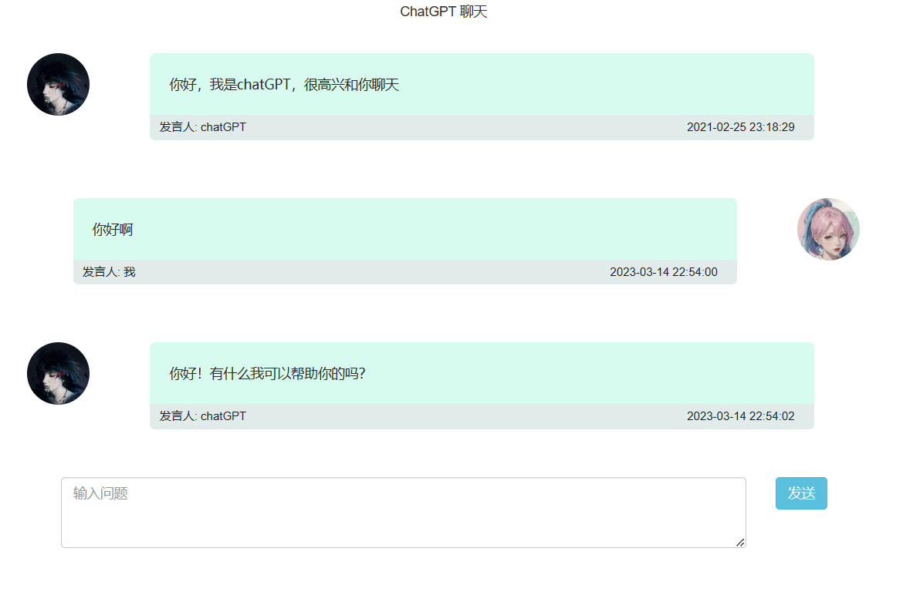

## 起步


> 对话效果

  
[访问地址](http://www.hlzblog.top/chat_gpt.html)  
[代码地址](storage/html/chat.html)  

> 目录介绍

`es6` 源代码路径  
本地开发环境 通过 `babel-node` 调试  
生产环境通过 [ncc](https://github.com/vercel/ncc) 打包对应功能模块到 `dist/` 各自目录下  

想了解代码结构 你可以先从`入口文件`开始

| 入口文件类型 | 文件位置 | 备注 |
| ---- | ---- | ---- |
| 爬虫任务 | `./es6/task.js`   | - |
| `HTTP`服务 | `./es6/www.js`   | - |


> 运行项目

先创建并修改配置文件 `app.yaml`  

```
cp app.example.yaml app.yaml
```

然后进入目录 `docker/unix`  

运行服务，默认会对外暴露 `3995` 端口，作为对外通信接口  
具体可以自行修改 `docker/unix/docker-compose.yml`  

```
make ini
```

通过集成的命令  
```
make log
```

看到有输出  

```
Listening node HTTP server Port on  4040
```

则表明，服务已启动成功


## 接口文档

> 写在前面

`GET参数` 中 `client_name` 是必填的入参，随便填点内容都行，主要是识别调用方    

注：目前接口都是 `30秒` 超时  

### 翻译接口


##### 入参

|字段名 | 字段类型 | 含义| 必选| 备注|
|--- |--- |--- |--- |--- |
| zh |string | 中文待翻译内容 |是 | 如果是双引号，请转为引号方便解码，对小说也没啥影响   |
| option | string | 用户提问唯一ID |是 | 枚举值: `en` 英文, `arabic` 阿拉伯语  |

```bash
curl --location --request POST 'http://www.hlzblog.top/translate/zh?client_name=mlf' \
--header 'Content-Type: application/json' \
--data-raw '{
    "zh":"沐临风是男主",
    "option": "arabic"
}'
```

##### 出参

|字段名 | 字段类型 | 含义| 必选| 备注|
|--- |--- |--- |--- |--- |
|code |int |状态码 | 是 |0:成功，其他表示请求失败 |
|msg |string |提示文案 |否 |请求失败时，返回错误描述|
|data |object |信息 |否 |会吐出的情况：业务状态码表现为成功时 |
|┠ text |string | 翻译结果 |是 | -  |


### 常规一问一答接口


##### 入参

|字段名 | 字段类型 | 含义| 必选| 备注|
|--- |--- |--- |--- |--- |
| text |string | 发问内容 |是 | -  |
| uniq_id | string | 用户提问唯一ID |是 | 如果想对话有上下文信息，这里可以填个字符串，如 [uuid](https://1024tools.com/uuid) 之类的，每次提问会延长缓存10分钟  |
| engine | string | 引擎类型 |是 | 枚举值: 不填:openAI, bing:微软---账号功能审核中暂时不可用 |


```bash
curl --location --request POST 'http://www.hlzblog.top/translate/general?client_name=mlf' \
--header 'Content-Type: application/json' \
--data-raw '{
    "text":"围绕'\''新能源车'\''这个主题，帮我想几个利于SEO且相关性较强的关键词",
    "uniq_id":"f958187b-3266-4562-9155-22932c3e894d",
    "engine":""
}'
```

##### 出参

|字段名 | 字段类型 | 含义| 必选| 备注|
|--- |--- |--- |--- |--- |
|code |int |状态码 | 是 |0:成功，其他表示请求失败 |
|msg |string |提示文案 |否 |请求失败时，返回错误描述|
|data |object |信息 |否 |会吐出的情况：业务状态码表现为成功时 |
|┠ text |string | 回答内容 |是 | -  |
|┠ conversation_id |string | 上下文会话ID |是 | 如果第一次和第二次请求，该值没发生变化，则表明，两次请求处于同一个会话  |


~~~json
{
  "code": 0,
  "msg": "success",
  "data": {
    "text": "1. 新能源车优惠 2. 新能源车减排 3. 新能源技术 4. 电动车续航 5. 电动车的未来 6. 电动车的安全性 7. 新能源车的发展 8. 新能源汽车使用成本 9. 新能源车的维修 10. 新能源车的耗能",
    "conversation_id": "846b30fc-2fb2-42a6-bc32-8ec010fcc705"
  }
}
~~~